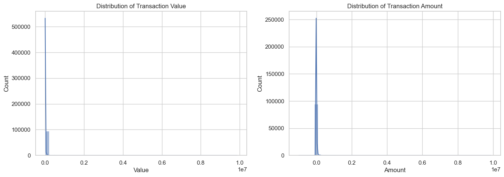
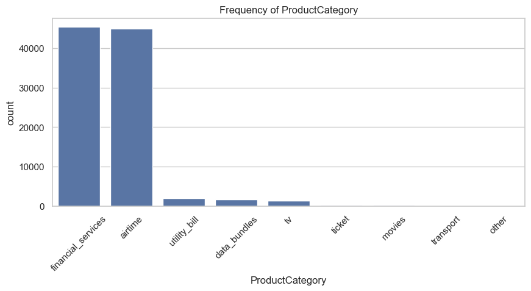
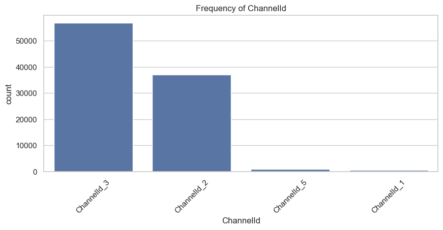
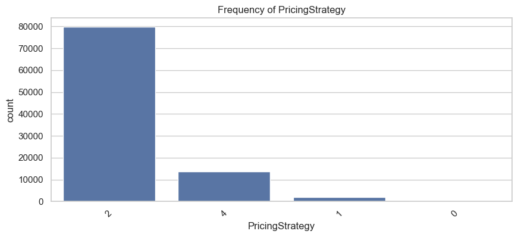
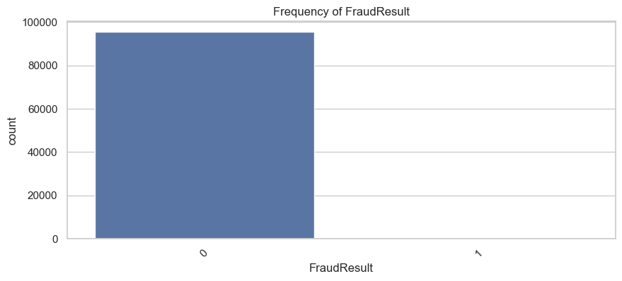
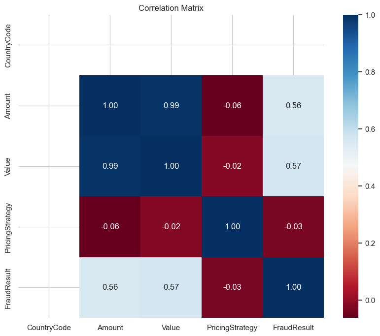
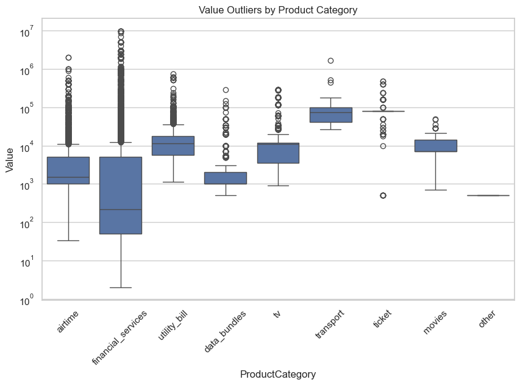

# The EDA Notebook 


```python
# impors and data loading 
import pandas as pd
import numpy as np
import matplotlib.pyplot as plt
import seaborn as sns

# Set visual style
sns.set(style="whitegrid")
plt.rcParams['figure.figsize'] = (12, 6)

# LOAD DATA (Update the path to your actual CSV file)
df = pd.read_csv('../data/raw/data.csv')

# Convert timestamp to datetime immediately
df['TransactionStartTime'] = pd.to_datetime(df['TransactionStartTime'])

# print data loading succesful
print("data loaded successfully")

```

    data loaded successfully
    


```python
# initial data preview 
print(f"Dataset Shape: {df.shape}")
print("\n--- Data Types ---")
print(df.dtypes)
display(df.head())
```

    Dataset Shape: (95662, 16)
    
    --- Data Types ---
    TransactionId                        object
    BatchId                              object
    AccountId                            object
    SubscriptionId                       object
    CustomerId                           object
    CurrencyCode                         object
    CountryCode                           int64
    ProviderId                           object
    ProductId                            object
    ProductCategory                      object
    ChannelId                            object
    Amount                              float64
    Value                                 int64
    TransactionStartTime    datetime64[ns, UTC]
    PricingStrategy                       int64
    FraudResult                           int64
    dtype: object
    


<div>
<style scoped>
    .dataframe tbody tr th:only-of-type {
        vertical-align: middle;
    }

    .dataframe tbody tr th {
        vertical-align: top;
    }

    .dataframe thead th {
        text-align: right;
    }
</style>
<table border="1" class="dataframe">
  <thead>
    <tr style="text-align: right;">
      <th></th>
      <th>TransactionId</th>
      <th>BatchId</th>
      <th>AccountId</th>
      <th>SubscriptionId</th>
      <th>CustomerId</th>
      <th>CurrencyCode</th>
      <th>CountryCode</th>
      <th>ProviderId</th>
      <th>ProductId</th>
      <th>ProductCategory</th>
      <th>ChannelId</th>
      <th>Amount</th>
      <th>Value</th>
      <th>TransactionStartTime</th>
      <th>PricingStrategy</th>
      <th>FraudResult</th>
    </tr>
  </thead>
  <tbody>
    <tr>
      <th>0</th>
      <td>TransactionId_76871</td>
      <td>BatchId_36123</td>
      <td>AccountId_3957</td>
      <td>SubscriptionId_887</td>
      <td>CustomerId_4406</td>
      <td>UGX</td>
      <td>256</td>
      <td>ProviderId_6</td>
      <td>ProductId_10</td>
      <td>airtime</td>
      <td>ChannelId_3</td>
      <td>1000.0</td>
      <td>1000</td>
      <td>2018-11-15 02:18:49+00:00</td>
      <td>2</td>
      <td>0</td>
    </tr>
    <tr>
      <th>1</th>
      <td>TransactionId_73770</td>
      <td>BatchId_15642</td>
      <td>AccountId_4841</td>
      <td>SubscriptionId_3829</td>
      <td>CustomerId_4406</td>
      <td>UGX</td>
      <td>256</td>
      <td>ProviderId_4</td>
      <td>ProductId_6</td>
      <td>financial_services</td>
      <td>ChannelId_2</td>
      <td>-20.0</td>
      <td>20</td>
      <td>2018-11-15 02:19:08+00:00</td>
      <td>2</td>
      <td>0</td>
    </tr>
    <tr>
      <th>2</th>
      <td>TransactionId_26203</td>
      <td>BatchId_53941</td>
      <td>AccountId_4229</td>
      <td>SubscriptionId_222</td>
      <td>CustomerId_4683</td>
      <td>UGX</td>
      <td>256</td>
      <td>ProviderId_6</td>
      <td>ProductId_1</td>
      <td>airtime</td>
      <td>ChannelId_3</td>
      <td>500.0</td>
      <td>500</td>
      <td>2018-11-15 02:44:21+00:00</td>
      <td>2</td>
      <td>0</td>
    </tr>
    <tr>
      <th>3</th>
      <td>TransactionId_380</td>
      <td>BatchId_102363</td>
      <td>AccountId_648</td>
      <td>SubscriptionId_2185</td>
      <td>CustomerId_988</td>
      <td>UGX</td>
      <td>256</td>
      <td>ProviderId_1</td>
      <td>ProductId_21</td>
      <td>utility_bill</td>
      <td>ChannelId_3</td>
      <td>20000.0</td>
      <td>21800</td>
      <td>2018-11-15 03:32:55+00:00</td>
      <td>2</td>
      <td>0</td>
    </tr>
    <tr>
      <th>4</th>
      <td>TransactionId_28195</td>
      <td>BatchId_38780</td>
      <td>AccountId_4841</td>
      <td>SubscriptionId_3829</td>
      <td>CustomerId_988</td>
      <td>UGX</td>
      <td>256</td>
      <td>ProviderId_4</td>
      <td>ProductId_6</td>
      <td>financial_services</td>
      <td>ChannelId_2</td>
      <td>-644.0</td>
      <td>644</td>
      <td>2018-11-15 03:34:21+00:00</td>
      <td>2</td>
      <td>0</td>
    </tr>
  </tbody>
</table>
</div>


```python
# missing values and summary statistics 
print("\n--- Missing Values ---")
print(df.isnull().sum())

print("\n--- Numerical Summary ---")
# Focus on Value and Amount
display(df[['Amount', 'Value']].describe())
```

    
    --- Missing Values ---
    TransactionId           0
    BatchId                 0
    AccountId               0
    SubscriptionId          0
    CustomerId              0
    CurrencyCode            0
    CountryCode             0
    ProviderId              0
    ProductId               0
    ProductCategory         0
    ChannelId               0
    Amount                  0
    Value                   0
    TransactionStartTime    0
    PricingStrategy         0
    FraudResult             0
    dtype: int64
    
    --- Numerical Summary ---
    


<div>
<style scoped>
    .dataframe tbody tr th:only-of-type {
        vertical-align: middle;
    }

    .dataframe tbody tr th {
        vertical-align: top;
    }

    .dataframe thead th {
        text-align: right;
    }
</style>
<table border="1" class="dataframe">
  <thead>
    <tr style="text-align: right;">
      <th></th>
      <th>Amount</th>
      <th>Value</th>
    </tr>
  </thead>
  <tbody>
    <tr>
      <th>count</th>
      <td>9.566200e+04</td>
      <td>9.566200e+04</td>
    </tr>
    <tr>
      <th>mean</th>
      <td>6.717846e+03</td>
      <td>9.900584e+03</td>
    </tr>
    <tr>
      <th>std</th>
      <td>1.233068e+05</td>
      <td>1.231221e+05</td>
    </tr>
    <tr>
      <th>min</th>
      <td>-1.000000e+06</td>
      <td>2.000000e+00</td>
    </tr>
    <tr>
      <th>25%</th>
      <td>-5.000000e+01</td>
      <td>2.750000e+02</td>
    </tr>
    <tr>
      <th>50%</th>
      <td>1.000000e+03</td>
      <td>1.000000e+03</td>
    </tr>
    <tr>
      <th>75%</th>
      <td>2.800000e+03</td>
      <td>5.000000e+03</td>
    </tr>
    <tr>
      <th>max</th>
      <td>9.880000e+06</td>
      <td>9.880000e+06</td>
    </tr>
  </tbody>
</table>
</div>


```python
# Distribution of Numerical Features (Visual)
fig, axes = plt.subplots(1, 2, figsize=(16, 5))

sns.histplot(df['Value'], bins=50, kde=True, ax=axes[0])
axes[0].set_title('Distribution of Transaction Value')

sns.histplot(df['Amount'], bins=50, kde=True, ax=axes[1])
axes[1].set_title('Distribution of Transaction Amount')

plt.show()
```


    

    


```python
# Distribution of Categorical Features
cat_cols = ['ProductCategory', 'ChannelId', 'PricingStrategy', 'FraudResult']

for col in cat_cols:
    plt.figure(figsize=(10, 4))
    sns.countplot(data=df, x=col, order=df[col].value_counts().index)
    plt.title(f'Frequency of {col}')
    plt.xticks(rotation=45)
    plt.show()
```


    

    


    

    


    

    


    

    


```python
# correaltion Analysis 
# Select only numerical columns for correlation
numerical_df = df.select_dtypes(include=[np.number])
plt.figure(figsize=(10, 8))
sns.heatmap(numerical_df.corr(), annot=True, cmap='RdBu', fmt='.2f')
plt.title('Correlation Matrix')
plt.show()
```


    

    


```python
# Outlier Detection (Box Plots)
plt.figure(figsize=(10, 6))
sns.boxplot(x='ProductCategory', y='Value', data=df)
plt.yscale('log') # Using log scale because transactions often have huge outliers
plt.title('Value Outliers by Product Category')
plt.xticks(rotation=45)
plt.show()
```


    

    


---

# Exploratory Data Analysis (EDA) Summary Report

## 1. Dataset Overview & Quality
*   **Volume:** The dataset contains **95,662 transactions** across 16 features.
*   **Data Integrity:** There are **zero missing values** across all fields, indicating a very clean raw dataset.
*   **Redundancy:** `Amount` and `Value` have a correlation of **0.99**. Since `Value` is the absolute magnitude and `Amount` includes the direction (debit/credit), we should use `Value` for monetary scaling and `Amount` to identify transaction types.

## 2. Key Insights & Statistical Observations

### A. Extreme Value Skewness & Outliers
*   **Observation:** Both Transaction `Value` and `Amount` exhibit extreme positive skewness. While the majority of transactions are small (median is likely in the $1,000–$5,000 range), outliers reach as high as **$10,000,000**.
*   **Product Context:** `Financial_Services` and `Airtime` are the most frequent categories, but `Financial_Services` contains the most significant outliers. `Transport` and `Ticket` categories have higher median values but much lower transaction volumes.
*   **Risk Implication:** High-value outliers in `Financial_Services` are prime candidates for default risk analysis. We should apply **log-transformation** or **Robust Scaling** to these features before modeling to prevent outliers from dominating the learning process.

### B. Categorical Dominance
*   **Channel Preference:** `ChannelId_3` and `ChannelId_2` account for the vast majority of transactions. Users on `ChannelId_1` and `ChannelId_5` are rare, making them potentially unique behavioral segments.
*   **Pricing Strategy:** `PricingStrategy_2` is the standard for nearly 80% of the data. Transactions under `PricingStrategy_0` are negligible.

### C. Fraud & Risk Correlation
*   **Fraud Imbalance:** The `FraudResult` is extremely imbalanced (near-zero frequency for Class 1). 
*   **Correlation Insight:** There is a **0.57 correlation** between `Value` and `FraudResult`. This suggests that as the transaction amount increases, the likelihood of fraud (and therefore credit risk) increases significantly. This validates the use of "Monetary" value as a core component of our proxy risk variable.

---
